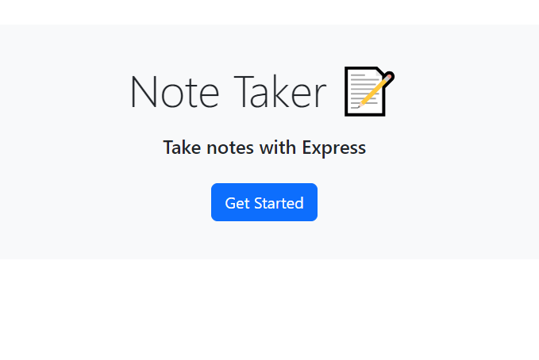
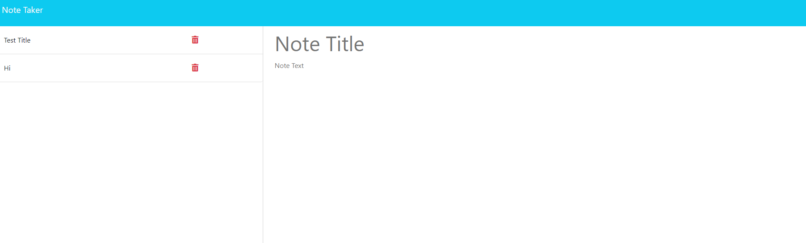
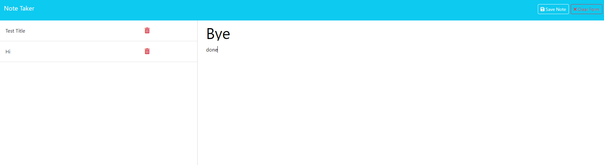
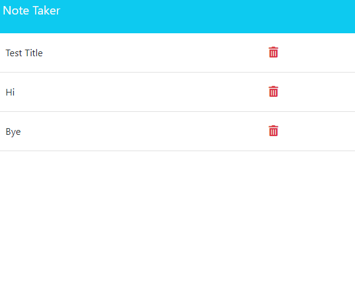

# 11 Notes-Crafter

## Description
For this project I struggeled with the start but with the help of my tutor I was able to find some ground to start on. After looking through again the day's works I
learnt a lot about how to make servers and set up routes. I was still struggled with the end but after a bit more assistance I was able to get the server to work allowing
for the html to open with the js and css working allowing for users to add and delete notes ect.

  ## Table of Contents
  * [User Story](#user-story)

  * [Acceptance Criteria](#acceptance-criteria)

  * [Installation](#installation)

  * [Images](#images)

  * [Links](#links)

## User Story

```
AS A small business owner
I WANT to be able to write and save notes
SO THAT I can organize my thoughts and keep track of tasks I need to complete
```

## Acceptance Criteria

```
GIVEN a note-taking application
WHEN I open the Note Taker
THEN I am presented with a landing page with a link to a notes page
WHEN I click on the link to the notes page
THEN I am presented with a page with existing notes listed in the left-hand column, plus empty fields to enter a new note title and the note’s text in the right-hand column
WHEN I enter a new note title and the note’s text
THEN a "Save Note" button and a "Clear Form" button appear in the navigation at the top of the page
WHEN I click on the Save button
THEN the new note I have entered is saved and appears in the left-hand column with the other existing notes and the buttons in the navigation disappear
WHEN I click on an existing note in the list in the left-hand column
THEN that note appears in the right-hand column and a "New Note" button appears in the navigation
WHEN I click on the "New Note" button in the navigation at the top of the page
THEN I am presented with empty fields to enter a new note title and the note’s text in the right-hand column and the button disappears
```

## Installation
npm i
npm i express
npm i uuid

## Images





## Links
Github: [Link text](https://github.com/Christopher-VA)
Email: [link text](cvonaltenstadt@gmail.com)

